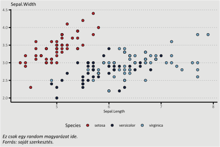

# Financial and Economic Review template

Welcome to the Financial and Economic Review (Hitelintézeti Szemle, HSZ) Template Repository! This GitHub repository contains a ready-to-use template for preparing and submitting your papers to HSZ. The template is designed to make your submission process smooth and hassle-free.

The [output](https://github.com/MarcellGranat/hsz/blob/main/template.docx) from the demo [file](https://github.com/MarcellGranat/hsz/blob/main/template.qmd).

This template enables you to use the simple markdown syntax. We prepared a minimalistic document with examples how to do that, but you can find further examples at <https://quarto.org/docs/output-formats/pdf-basics.html>.

## How to start?

1.  Install quarto in R

```{r}
install.packages("quarto")
```

2.  Activate this template from the terminal. In Rstudio: open the terminal & type:

```         
quarto install extension MarcellGranat/hsz
```

3.  Open a new .qmd file (file \> new file \> Quarto Document)

4.  Fill out the yaml as in the [template.qmd](https://github.com/MarcellGranat/hsz/blob/main/template.qmd)

## What else?

If you don't want to edit your work in Markdown, the following files in the `_extensions/hsz` folder may help you:

```         
├── custom-reference-doc.docx
```

A ready-to-use docx template file to use with quarto or pandoc.

```         
├── hsz.csl
```

HSZ compatible bibliography style for Zotero (for Word plugin) and Latex.

```         
├── template.qmd
```

This template contains a full setup and example to plot in HSZ style in GGplot.



# Limitations

1.  Figure captions can not be located to the top. This is a [known issue](https://github.com/quarto-dev/quarto-cli/issues/2221) with docx format, so u have to replace it manually.

2.  JEL codes after the abstarct will be separeted with alt + enter (default markdown `\`). This is something that migth be solved in future versions.
